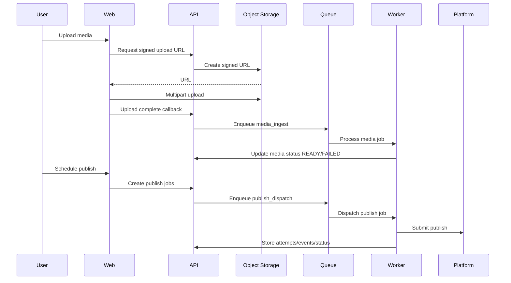

# Architecture

## Design Principles

- Stateless API and web tiers
- Direct-to-storage uploads for large media
- Queue-driven asynchronous media/publish workflows
- Capability-driven platform adapter architecture
- Idempotent publish operations with durable attempt/event logs

## Services

- `apps/web`: Next.js App Router frontend with locale + RTL-ready structure
- `apps/api`: NestJS REST API with Prisma, auth, workspace access
- `apps/worker`: BullMQ worker service for background orchestration
- `postgres`: source of truth for domain entities
- `redis`: queue transport, scheduling, retries
- `object storage`: raw and processed media objects

## Core Flow

## Data Ownership

- API owns writes to relational state
- Worker owns async state transitions with idempotency guarantees
- Object storage owns binary media
- Platform adapter layer owns external payload translation and error normalization
